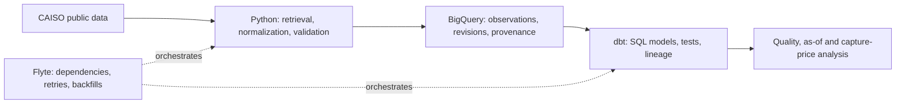

# power-market-data-platform

Revision-aware data platform for ingesting, validating, modeling, and analyzing
U.S. wholesale power-market data.

Public market data is not necessarily final when first retrieved. An interval
can arrive late, be corrected, or appear differently in a later download.
Timestamps can also hide local-time ambiguity or incompatible interval labels.

The engineering thesis is that an analytical result should be traceable to its
source observations and to what the system knew at the time. That requires
explicit event and knowledge times, source provenance, preserved material
revisions, idempotent reruns, and visible data-quality failures.

## Current status

**Phase 0: repository and tooling foundation.** The implemented Python package
exposes its installed version. The repository includes an offline packaging
test, Ruff, strict mypy, a build configuration, and GitHub Actions for Python 3.12
on Windows and Linux.

There is no ingestion pipeline, stored market dataset, cloud deployment, dbt
project, or Flyte workflow yet. The architecture below is planned.

## Planned architecture



A corrected price for the same interval and location represents a changed
observation, not a new market interval. Overwriting it prevents an earlier result
from being explained; appending every unchanged download creates duplicates.
The planned persistence contract separates logical identity from content
versions and their observed history, including a value that changes and later
returns to its original state.

Canonical analytical time will be UTC. Source labels and timezone context can be
retained for interpretation. Historical backfills will not be presented as
evidence of what this system knew before it collected the data.

See the [project brief](PROJECT_BRIEF.md), [phase completion criteria](PLANS.md),
and [architecture decisions](docs/adr/).

## Planned phases

| Phase | Focus |
| --- | --- |
| 0 | Repository/tooling foundation (current) |
| 1 | CAISO source adapters and normalization |
| 2 | Revision-aware BigQuery persistence |
| 3 | dbt analytical warehouse |
| 4 | Flyte orchestration and backfills |
| 5 | Data-quality/as-of/capture-price analytics |
| 6 | Public portfolio/reproducibility audit |

## Repository structure

```text
.github/workflows/ci.yml     Offline validation after dependency installation
docs/adr/                   Architecture and Python compatibility decisions
src/power_market_data/      Installable package; version metadata only
tests/fixtures/             Fixture policy; no market data collected yet
tests/test_package.py       Isolated installed-package import test
AGENTS.md                   Engineering contract
PROJECT_BRIEF.md            Motivation and scope
PLANS.md                    Deliverables and completion criteria
pyproject.toml              Packaging, development dependencies and checks
.env.example                Future configuration names, no credentials
```

## Local setup

Use Python 3.12. The [compatibility decision](docs/adr/004-python-tooling.md)
records the future-stack check and its limitations. Phase 0 has no runtime
dependencies; the development extra pins the direct validation tools.

From the repository root, on Windows PowerShell:

```powershell
py -3.12 -m venv .venv
.\.venv\Scripts\python.exe -m pip install -e ".[dev]"
```

If the Python launcher is absent in a Codex desktop environment, this is the
bundled-interpreter fallback used during initial setup:

```powershell
$python312 = Join-Path $env:USERPROFILE '.cache\codex-runtimes\codex-primary-runtime\dependencies\python\python.exe'
& $python312 -m venv .venv
.\.venv\Scripts\python.exe -m pip install -e ".[dev]"
```

The bundle path is specific to that environment; other machines can use their
installed Python 3.12 executable. No environment activation or PowerShell
execution-policy change is required.

On Linux/macOS:

```sh
python3.12 -m venv .venv
.venv/bin/python -m pip install -e ".[dev]"
```

Installation downloads packages. Validation thereafter requires no CAISO access,
cloud credentials, Docker, or WSL. Package builds may download their isolated
build dependencies. Nothing reads .env in Phase 0; .env.example reserves names
for later work, and local .env files are ignored.

## Validation

Windows PowerShell, from the repository root:

```powershell
.\.venv\Scripts\python.exe -m pip check
.\.venv\Scripts\python.exe -m ruff check .
.\.venv\Scripts\python.exe -m ruff format --check .
.\.venv\Scripts\python.exe -m mypy
.\.venv\Scripts\python.exe -m pytest
.\.venv\Scripts\python.exe -I -c "import power_market_data; print(power_market_data.__version__)"
.\.venv\Scripts\python.exe -m build
```

On Linux/macOS, use .venv/bin/python in place of .\.venv\Scripts\python.exe.
CI also replaces the editable installation with the built wheel and reruns the
import and test. This checks that installation works independently of the
repository's working directory. Tests do not call external services.

## Limitations

The test currently verifies packaging, not market-data correctness. Future
phases must establish source-specific interval semantics, data licenses,
revision behavior, coverage, and cloud costs. Compatibility resolution is not a
substitute for integrating or deploying the future stack. Direct development
tools are pinned, but transitive dependencies are not yet fully locked.

Trading strategy, automated bidding, dispatch optimization, production P&L,
proprietary forecasting, and battery optimization are outside scope.
