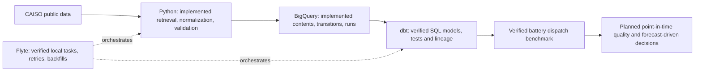

# power-market-data-platform

Revision-aware data platform for ingesting, validating, modeling, and analyzing
U.S. wholesale power-market data.

Public market data is not necessarily final when first retrieved. An interval
can arrive late, be corrected, or appear differently in a later download.
Timestamps can also hide local-time ambiguity or incompatible interval labels.

The engineering thesis is that an analytical result should be traceable to its
source observations and to what the system knew at the time. That requires
explicit event and knowledge times, source provenance, preserved material
revisions, idempotent reruns, and visible data-quality failures.

## Current status

**Phase 5: verified battery dispatch model and three-day perfect-foresight benchmark.**
The existing CAISO adapter fetches hourly day-ahead LMP at NP15/SP15/ZP26 and five-minute system load.
Normalized observations can now be persisted with ingestion manifests, distinct
source contents, ordered state transitions and explicit knowledge times.

A repeated A→A creates another run, not another revision. A→B→A preserves two
unique contents and three transitions, including the later return to A.
BigQuery transactions and a native sequencing guard prevent partial successful
batches and reject stale cooperating writers. See the
[warehouse contract](docs/contracts/warehouse.md) and [ADR 005](docs/adr/005-bigquery-persistence.md)
for the exact commit, recovery, clock and concurrency limitations.

The adapter uses gridstatus 0.36.0. Its fall-back load parser cannot reliably
distinguish repeated local hours, so those load dates remain unsupported.
Phase 1 [source](docs/sources/caiso.md) and [domain/time](docs/contracts/observations.md)
contracts are unchanged. BigQuery uses native google-cloud-bigquery 3.45.2.

Offline tests cover source normalization, identities, DST, warehouse planning,
client failure behavior and CLI commands. Separate opt-in tests use disposable
BigQuery datasets. [Recorded verification](docs/verification/phase2.md) includes
real-day counts, an unchanged rerun, recovery and cost metadata. Windows/Linux CI
remains offline after dependency installation.
The standalone dbt project now contains accepted revision histories, incremental
current LMP/load facts and daily-price/ingestion summaries. Offline SQL tests and
a credential-free project parse pass. Controlled BigQuery verification covers
unchanged repeats, revisions, reappearance, late arrivals, unsuccessful-run
exclusion and incremental/full-refresh equality. Phase 3 initially verified
24 hourly NP15 LMP facts and 288 five-minute load facts, with an unchanged
second build preserving every output row. The Phase 3 catalog described 11 models
and 5 raw sources. The earlier quota-blocked attempt remains documented. See the
[analytics contract](docs/contracts/analytics.md),
[toolchain decision](docs/adr/006-dbt-analytical-state.md) and
[Phase 3 verification](docs/verification/phase3.md).
Flyte 2.8.1 now coordinates one through seven completed Pacific dates, serial
bounded ingestion, then dbt and analytical verification. Stable run IDs preserve
successful requests across interruption; fresh retrievals use new attempt IDs.
The controlled recovery suite and a real August 2–3 NP15/load backfill passed.
A fresh real retrieval added no contents or transitions, changed no fact rows,
and produced zero-row dbt fact MERGEs. The verified sample now contains 72 LMP
and 864 load facts across August 1–3. See the
[orchestration contract](docs/contracts/orchestration.md),
[ADR 007](docs/adr/007-local-flyte-orchestration.md) and
[Phase 4 verification](docs/verification/phase4.md), including quota failures,
temporary authorized allowances and restoration to the normal safeguards.
There is no automated scheduler, remote Flyte deployment, final Data Quality
Observatory, as-of consumer query or capture-price analysis.

Phase 5 adds a CVXPY/HiGHS battery MILP, independent daily backtesting, strict
hourly input validation and a current-price dbt input view. Hand-computed tests
and native input reconciliation pass. All 72 August 1–3 NP15 prices flow through
the mart/adapter into three optimal, independently checked daily schedules.
For the illustrative 4 MWh / 1 MW battery, total simulated gross arbitrage value
was 386.732757 USD across those three days. This is a perfect-foresight benchmark,
not bidding, forecasting or asset P&L, and it cannot establish general economics.
The initial quota-blocked attempt and later completion after ordinary reset are
recorded in [Phase 5 verification](docs/verification/phase5.md). See the
[mathematical/input contract](docs/contracts/battery_optimization.md). Windows/Linux
CI passes; [PR #6](https://github.com/AdvaitBP/power-market-data-platform/pull/6)
records final review and merge status.

## Architecture and planned layers



A corrected price for the same interval and location represents a changed
observation, not a new market interval. Overwriting it prevents an earlier result
from being explained; appending every unchanged download creates duplicates.
The persistence contract separates logical identity from content
versions and their observed history, including a value that changes and later
returns to its original state.

Canonical analytical time is UTC; the CLI also renders Pacific offsets for
interpretation. Raw source files are not retained. Historical backfills
will not be presented as evidence of what this system knew before it collected the data.

See the [project brief](PROJECT_BRIEF.md), [phase completion criteria](PLANS.md),
and [architecture decisions](docs/adr/).

## Planned phases

| Phase | Focus |
| --- | --- |
| 0 | Repository/tooling foundation — complete |
| 1 | CAISO source adapters and normalization — complete within documented limits |
| 2 | Revision-aware BigQuery persistence — complete within documented limits |
| 3 | dbt analytical warehouse — complete within documented limits |
| 4 | Flyte orchestration and backfills — complete within documented limits |
| 5 | Battery optimization and perfect-foresight backtesting — complete within documented model/sample limits |
| 6 | Point-in-time quality, forecasting and forecast-driven dispatch — planned |
| 7 | Public reproducibility audit — planned |

## Repository structure

```text
.github/workflows/ci.yml     Offline validation after dependency installation
docs/adr/                   Architecture and Python compatibility decisions
src/power_market_data/      Source, warehouse, optimization/backtesting, CLI
docs/sources/               Verified access methods and provenance limitations
docs/contracts/            Observation and warehouse grains, clocks, identities, recovery
tests/fixtures/             Small synthetic source-shape fixtures
tests/                     Offline source, warehouse and package tests
integration_tests/         Explicitly opted-in raw-persistence BigQuery tests
dbt/                       SQL models, sources, contracts, unit/data tests, profile example
dbt_checks/                Shared synthetic dbt contract fixtures
dbt_integration_tests/     Opt-in native dbt builds in disposable datasets
orchestration/             Optional Flyte tasks, bounded plans and dbt subprocess
orchestration_checks/      Credential-free native Flyte fixture execution
orchestration_integration_tests/  Opt-in disposable recovery/equivalence test
AGENTS.md                   Engineering contract
PROJECT_BRIEF.md            Motivation and scope
PLANS.md                    Deliverables and completion criteria
pyproject.toml              Packaging, development dependencies and checks
.env.example                Non-secret warehouse configuration names
```

## Local setup

Use Python 3.12. The [compatibility decision](docs/adr/004-python-tooling.md)
records the initial future-stack check and its limitations. Runtime dependencies
are gridstatus==0.36.0, google-cloud-bigquery==3.45.2 and Windows timezone data.
The development extra pins direct validation tools. No ORM or transitive lockfile
is added. dbt and Flyte use separate repository-local tooling environments;
neither is a core application runtime dependency.

From the repository root, on Windows PowerShell:

```powershell
py -3.12 -m venv .venv
.\.venv\Scripts\python.exe -m pip install -e ".[dev,optimization]"
```

If the Python launcher is absent in a Codex desktop environment, this is the
bundled-interpreter fallback used during initial setup:

```powershell
$python312 = Join-Path $env:USERPROFILE '.cache\codex-runtimes\codex-primary-runtime\dependencies\python\python.exe'
& $python312 -m venv .venv
.\.venv\Scripts\python.exe -m pip install -e ".[dev,optimization]"
```

The bundle path is specific to that environment; other machines can use their
installed Python 3.12 executable. No environment activation or PowerShell
execution-policy change is required.

On Linux/macOS:

```sh
python3.12 -m venv .venv
.venv/bin/python -m pip install -e ".[dev,optimization]"
```

The full validation environment includes the optional optimization extra. For
ingestion-only use, `pip install -e .` does not install CVXPY/HiGHS.
Installation downloads packages. Validation thereafter requires no CAISO access,
cloud credentials, Docker, or WSL. Package builds may download their isolated
build dependencies. Configuration reads process environment variables; no dotenv
loader is used.
.env.example lists non-secret names, and local .env files are ignored.

## Live source inspection

After installation, from Windows PowerShell:

```powershell
.\.venv\Scripts\power-market-data.exe caiso lmp --date 2026-08-01 --location TH_NP15_GEN-APND --limit 2
.\.venv\Scripts\power-market-data.exe caiso load --date 2026-08-01 --limit 2
```

On Linux/macOS, use .venv/bin/power-market-data. Alternatively run the same
arguments with the environment interpreter and -m power_market_data.cli.
--limit bounds printed rows; each request fetches one historical Pacific day.
Output includes UTC intervals, explicit Pacific offsets, decimal strings, source
metadata and SHA-256 identities. No cloud write or local data file is produced.
Errors return nonzero exit status. The installed CLI succeeded for both examples
on 2026-09-20 (24 LMP rows and 288 load rows); this does not guarantee other dates.

## Persist a bounded source request

Authenticate using user Application Default Credentials and configure a dedicated
billing-enabled Google Cloud project. BigQuery's no-billing sandbox does not
support this DML contract. Credentials must stay outside Git and .env.

```powershell
$env:GCP_PROJECT_ID = "your-dedicated-project-id"
$env:BQ_LOCATION = "US"
$env:BQ_RAW_DATASET = "power_market_raw"
.\.venv\Scripts\power-market-data.exe warehouse bootstrap
.\.venv\Scripts\power-market-data.exe ingest caiso lmp --date 2026-08-01 --location TH_NP15_GEN-APND
.\.venv\Scripts\power-market-data.exe warehouse inspect lmp --date 2026-08-01 --location TH_NP15_GEN-APND
```

The CLI prints the run ID before source access. A repeated command with a new ID
is a new attempt; an unchanged source state adds no content or transition.
warehouse resume --run-id ID reconciles a submitted commit without fetching again.
A terminal failure requires a new attempt. Bootstrap never recreates existing data.

Python queries have a 100 MiB maximum-bytes-billed ceiling. This is a bounded
portfolio workload, not a promise of zero cost; budget alerts are not spending
caps. See [costs, setup, integration tests and cleanup](docs/contracts/warehouse.md).

## dbt transformations

The selected stable toolchain is dbt-core 1.12.5 plus dbt-bigquery 1.12.1 in a
separate repository-local environment. The recommended free v2 distribution was
evaluated first; observed job metadata did not carry its configured query cap,
so the [ADR](docs/adr/006-dbt-analytical-state.md) records this compatibility exception.
Follow the [PowerShell setup/build/docs commands](docs/contracts/analytics.md#local-tooling-and-execution).
The target is a separate, configurable power_market_analytics dataset in US.
Never point it at raw storage. Ordinary CI does not execute warehouse queries.

## Bounded Flyte backfills

Install the isolated Flyte 2.8.1 environment and use the explicit JSON plan in
[the local setup and command examples](docs/contracts/orchestration.md#reproducible-native-setup-and-commands).
The manually invoked local graph calls the existing ingestion service once per
product/date/hub, then runs dbt only after all required requests succeed.
Concurrency is one because raw commits share a sequencing/finalization guard.

Save the backfill UUID. Reusing it resumes the same attempts and skips retrieval
for existing successes; a new UUID means a fresh retrieval. Failed requests stop
later work and dbt without rolling back earlier accepted days. Only narrowly
classified transient failures receive one automatic retry. Quota errors and
uncertain commits stop for diagnosis/reconciliation. The normal safeguards are
5 GiB/day, a $1 monthly budget alert and 100 MiB/query caps; a seven-day plan is
not a promise that the complete graph fits the daily allowance.

Only one cooperating backfill/dbt writer may use a target at a time. Local Flyte
requires no cluster, Docker, WSL or scheduler. Ordinary CI runs the native fixture
graph without credentials; the separate cloud recovery suite is explicitly opt-in.

## Daily battery benchmark

The illustrative reference battery is 4 MWh / 1 MW, charge/discharge efficiency
0.95 each, initial=terminal SOC 2 MWh and zero modeled throughput cost. The MILP
forbids simultaneous charging/discharging and independently reconciles SOC and
cash flow. Daily horizons reset SOC; they do not carry energy between days.

```powershell
.\.venv\Scripts\power-market-data.exe battery-backtest --start-date 2026-08-01 --end-date 2026-08-01 --location TH_NP15_GEN-APND --config examples/battery_reference.json --input-json tests/fixtures/battery_prices.json
```

This example is synthetic and needs no credentials. The command returns input
lineage, dispatch, numerical diagnostics and descriptive daily/aggregate metrics.
Optional `--output` and `--figure` paths save a local JSON report and one daily
HTML plot. See the [contract](docs/contracts/battery_optimization.md#reproducible-local-commands)
for live current-mart commands and the recorded verification. The sample
has no forecast, market impact, ancillary services or general economic inference.

## Validation

Windows PowerShell, from the repository root:

```powershell
.\.venv\Scripts\python.exe -m pip check
.\.venv\Scripts\python.exe -m ruff check .
.\.venv\Scripts\python.exe -m ruff format --check .
.\.venv\Scripts\python.exe -m mypy
.\.venv\Scripts\python.exe -m pytest
.\.venv\Scripts\python.exe -I -c "import power_market_data; print(power_market_data.__version__)"
.\.venv\Scripts\python.exe -m build
```

On Linux/macOS, use .venv/bin/python in place of .\.venv\Scripts\python.exe.
CI also replaces the editable installation with the built wheel and reruns the
import and test. This checks that installation works independently of the
repository's working directory. Ordinary tests do not call external services.

## Limitations

Validation applies to rows returned by gridstatus, which may already have dropped
missing rows or pivoted duplicate components. Full-day completeness is not
asserted. Fall-back load dates are rejected; the source notes describe other
schema, transport and usage limitations. Fixtures are synthetic and ordinary
tests make no source or cloud calls. Durable contents and observed transitions
exist, but no raw response archive or verified source-deletion signal exists.
Writers must follow the documented transaction protocol; finalization can require
explicit recovery. dbt facts depend on ordered raw finalization and one dbt writer;
the graph is not an atomic snapshot of concurrent ingestion. Current data covers
three real market days at NP15 plus system load; summaries do not establish
source completeness. Flyte runs locally with explicit plans and one cooperating
writer; no remote control plane or automated scheduler is deployed. There is no
final Data Quality Observatory, as-of consumer query, forecasting or capture-price
analysis. The battery benchmark uses only three NP15 days, a hypothetical
price-taking battery and energy-only cash flows. Perfect foresight/current revised prices
do not represent information available to a historical operator.
Direct development tools are pinned; transitive dependencies are not fully locked.

The original roadmap excluded battery optimization. [ADR 008](docs/adr/008-battery-benchmark.md)
explicitly revises that choice: Phase 5 develops a local, energy-only,
perfect-foresight battery benchmark. Forecasting and as-of work are deferred to
Phase 6. Real trading strategy, automated bidding, operational scheduling,
production P&L and proprietary forecasting remain outside scope.
