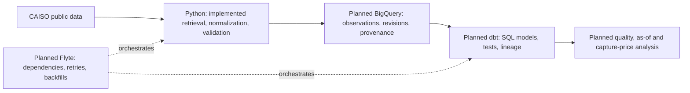

# power-market-data-platform

Revision-aware data platform for ingesting, validating, modeling, and analyzing
U.S. wholesale power-market data.

Public market data is not necessarily final when first retrieved. An interval
can arrive late, be corrected, or appear differently in a later download.
Timestamps can also hide local-time ambiguity or incompatible interval labels.

The engineering thesis is that an analytical result should be traceable to its
source observations and to what the system knew at the time. That requires
explicit event and knowledge times, source provenance, preserved material
revisions, idempotent reruns, and visible data-quality failures.

## Current status

**Phase 1: CAISO source adapters and normalization.** Implemented products are
hourly day-ahead LMP at the NP15, SP15 and ZP26 trading hubs, and five-minute
CAISO system load from Today's Outlook. The CLI fetches one historical Pacific
day, validates it and prints normalized records with UTC intervals, provenance,
logical keys and content hashes. It does not persist fetched observations.

The adapter uses stable gridstatus 0.36.0. Its fall-back load parser cannot
reliably distinguish repeated local hours, so load requests for those dates fail
explicitly. See the [source contract](docs/sources/caiso.md) and
[domain/time contract](docs/contracts/observations.md).

Offline tests cover normalization, malformed inputs, identities, DST and CLI
behavior; Windows/Linux CI also checks packaging, Ruff and strict mypy.
BigQuery, dbt, Flyte, durable revision history and analytics remain unimplemented.

## Architecture and planned layers



A corrected price for the same interval and location represents a changed
observation, not a new market interval. Overwriting it prevents an earlier result
from being explained; appending every unchanged download creates duplicates.
The planned persistence contract separates logical identity from content
versions and their observed history, including a value that changes and later
returns to its original state.

Canonical analytical time is UTC; the CLI also renders Pacific offsets for
interpretation. Raw source files are not retained in Phase 1. Historical backfills
will not be presented as evidence of what this system knew before it collected the data.

See the [project brief](PROJECT_BRIEF.md), [phase completion criteria](PLANS.md),
and [architecture decisions](docs/adr/).

## Planned phases

| Phase | Focus |
| --- | --- |
| 0 | Repository/tooling foundation — complete |
| 1 | CAISO source adapters and normalization — complete within documented limits |
| 2 | Revision-aware BigQuery persistence |
| 3 | dbt analytical warehouse |
| 4 | Flyte orchestration and backfills |
| 5 | Data-quality/as-of/capture-price analytics |
| 6 | Public portfolio/reproducibility audit |

## Repository structure

```text
.github/workflows/ci.yml     Offline validation after dependency installation
docs/adr/                   Architecture and Python compatibility decisions
src/power_market_data/      CAISO adapter, domain records, identity/time code, CLI
docs/sources/               Verified access methods and provenance limitations
docs/contracts/            Grain, values, identity serialization and time rules
tests/fixtures/             Small synthetic source-shape fixtures
tests/                     Offline behavior, CLI and installed-package tests
AGENTS.md                   Engineering contract
PROJECT_BRIEF.md            Motivation and scope
PLANS.md                    Deliverables and completion criteria
pyproject.toml              Packaging, development dependencies and checks
.env.example                Future configuration names, no credentials
```

## Local setup

Use Python 3.12. The [compatibility decision](docs/adr/004-python-tooling.md)
records the initial future-stack check and its limitations. Phase 1 adds
gridstatus==0.36.0 and Windows timezone data; the development extra pins the
direct validation tools. No other framework or transitive lockfile is added.

From the repository root, on Windows PowerShell:

```powershell
py -3.12 -m venv .venv
.\.venv\Scripts\python.exe -m pip install -e ".[dev]"
```

If the Python launcher is absent in a Codex desktop environment, this is the
bundled-interpreter fallback used during initial setup:

```powershell
$python312 = Join-Path $env:USERPROFILE '.cache\codex-runtimes\codex-primary-runtime\dependencies\python\python.exe'
& $python312 -m venv .venv
.\.venv\Scripts\python.exe -m pip install -e ".[dev]"
```

The bundle path is specific to that environment; other machines can use their
installed Python 3.12 executable. No environment activation or PowerShell
execution-policy change is required.

On Linux/macOS:

```sh
python3.12 -m venv .venv
.venv/bin/python -m pip install -e ".[dev]"
```

Installation downloads packages. Validation thereafter requires no CAISO access,
cloud credentials, Docker, or WSL. Package builds may download their isolated
build dependencies. Nothing reads .env in Phase 1; .env.example reserves names
for later work, and local .env files are ignored.

## Live source inspection

After installation, from Windows PowerShell:

```powershell
.\.venv\Scripts\power-market-data.exe caiso lmp --date 2026-08-01 --location TH_NP15_GEN-APND --limit 2
.\.venv\Scripts\power-market-data.exe caiso load --date 2026-08-01 --limit 2
```

On Linux/macOS, use .venv/bin/power-market-data. Alternatively run the same
arguments with the environment interpreter and -m power_market_data.cli.
--limit bounds printed rows; each request fetches one historical Pacific day.
Output includes UTC intervals, explicit Pacific offsets, decimal strings, source
metadata and SHA-256 identities. No cloud write or local data file is produced.
Errors return nonzero exit status. The installed CLI succeeded for both examples
on 2026-09-20 (24 LMP rows and 288 load rows); this does not guarantee other dates.

## Validation

Windows PowerShell, from the repository root:

```powershell
.\.venv\Scripts\python.exe -m pip check
.\.venv\Scripts\python.exe -m ruff check .
.\.venv\Scripts\python.exe -m ruff format --check .
.\.venv\Scripts\python.exe -m mypy
.\.venv\Scripts\python.exe -m pytest
.\.venv\Scripts\python.exe -I -c "import power_market_data; print(power_market_data.__version__)"
.\.venv\Scripts\python.exe -m build
```

On Linux/macOS, use .venv/bin/python in place of .\.venv\Scripts\python.exe.
CI also replaces the editable installation with the built wheel and reruns the
import and test. This checks that installation works independently of the
repository's working directory. Tests do not call external services.

## Limitations

Validation applies to rows returned by gridstatus, which may already have dropped
missing rows or pivoted duplicate components. Full-day completeness is not
asserted. Fall-back load dates are rejected; the source notes describe other
schema, transport and usage limitations. Fixtures are synthetic and ordinary
tests make no source calls. No raw response archive or source-version persistence
exists; a content hash alone cannot reconstruct revision history. There is no
BigQuery, dbt, Flyte, as-of warehouse querying, or capture-price analysis yet.
Direct development tools are pinned; transitive dependencies are not fully locked.

Trading strategy, automated bidding, dispatch optimization, production P&L,
proprietary forecasting, and battery optimization are outside scope.
