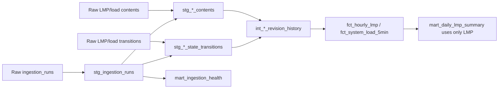

# dbt analytical model contract

Phase 3 adds SQL consumers of the unchanged [warehouse contract](warehouse.md).
See [ADR 006](../adr/006-dbt-analytical-state.md) for tooling and alternatives,
and [verification](../verification/phase3.md) for what has actually run.

## Eligibility and lineage

Only a transition whose run is SUCCEEDED and whose content's first run is
SUCCEEDED can enter market history/facts. COMMITTED means data committed but
knowledge-time finalization is incomplete; it is not analytical success.
STARTED and FAILED are also excluded. Nothing rewrites raw tables or hashes.



warehouse_control is an operational sequencing guard, not a dbt source.
The five raw sources have explicit field descriptions/types in
dbt/models/sources/raw.yml. Source properties are preserved, not recalculated.
No LMP/load join or hourly load aggregation exists.

## Model grains and semantics

All clocks below are BigQuery TIMESTAMP in UTC. market_date/requested_date are
Pacific dates. All monetary fields remain NUMERIC USD/MWh; load is NUMERIC MW.

| Model | Exact grain and key | History/current, units and eligibility |
| --- | --- | --- |
| stg_ingestion_runs | One row per run_id | All attempted runs and statuses; row/byte counts; unknown optional diagnostics/counts/times remain NULL. |
| stg_lmp_contents | One row per content_id | All distinct accepted LMP contents; USD/MWh; first_run_id must be SUCCEEDED. |
| stg_load_contents | One row per content_id | All distinct accepted load contents; MW; first_run_id must be SUCCEEDED. |
| stg_lmp_state_transitions | One row per transition_id | All accepted LMP occurrences; run_id must be SUCCEEDED. |
| stg_load_state_transitions | One row per transition_id | All accepted load occurrences; run_id must be SUCCEEDED. |
| int_lmp_revision_history | One row per eligible LMP transition_id joined to its content | Occurrence history, including a return to old content; USD/MWh. |
| int_load_revision_history | One row per eligible load transition_id joined to its content | Occurrence history, including a return to old content; MW. |
| fct_hourly_lmp | One row per logical_key representing the latest successfully accepted CAISO day-ahead hourly LMP state for one supported hub and one UTC hourly interval | Current state; LMP and components in USD/MWh; preserves lineage. |
| fct_system_load_5min | One row per logical_key representing the latest successfully accepted CAISO system-load state for one UTC five-minute interval | Current state; average power in MW, not energy. |
| mart_daily_lmp_summary | One row per source, market, location and Pacific market_date | Current LMP aggregate; observed-hour counts and USD/MWh statistics; no completeness assertion. |
| mart_ingestion_health | One row per source, product, requested_date and requested_location | Operational history; NULL requested_location is the load group; all statuses counted, accepted/new counts summed only for success. |

History and facts retain content_id, logical_key, content_hash and their schema
versions; they neither regenerate nor compare incompatible hashes. State metadata
is transition_id, state_run_id, state_ordinal and commit_sequence. Required market
values are never filled with zero or coalesced away. A successful state requires
non-NULL first_seen_at and state_known_at; tests expose violations. Missing joined
content is not invented: raw-to-history reconciliation exposes the missing row.

content_retrieved_at_utc belongs to the original content's retrieval;
state_retrieved_at_utc belongs to this occurrence. first_seen_at is the original
successful durable knowledge time of the content; state_known_at is this
transition's successful durable knowledge time. Neither is CAISO publication time.

## A→B→A and incremental processing

| Retrieval | Unique accepted contents | Occurrences | Fact value |
| --- | --- | --- | --- |
| A | A | 1:A | A |
| A again | A | 1:A | A |
| B | A, B | 1:A, 2:B | B |
| A returns | A, B | 1:A, 2:B, 3:A | A |

The last row references A's original first_seen_at and the newer state_known_at.
Facts rank transitions by state_ordinal DESC, commit_sequence DESC,
transition_id DESC, not by content age.

Both facts are incremental merge models keyed by logical_key. On first build or
full refresh they rank all eligible history. Later runs select only transitions
with commit_sequence greater than the fact's stored maximum, rank those candidates
and merge them. A new logical key inserts; B or a later A updates the existing row.
An event in 2025 with a new acceptance sequence in 2026 is included.

This relies on Phase 2 ordered finalization and immutable accepted history.
It is not safe after external history deletion, eligibility rewrites or manual
watermark edits. Full refresh is the explicit recovery/rebuild path. There are no
source retractions/tombstones. on_schema_change=fail prevents silent column drift.
A full refresh is expected to equal incremental results on unchanged input; the
controlled test checks every fact field, not merely counts. It must be executed
in BigQuery before claiming that native materialization is verified.

## Time, day boundaries and nulls

Intervals are half-open [start,end): one elapsed hour for LMP, five minutes for
load. Canonical identity and ordering remain UTC. Market dates come from raw
Pacific dates and are checked against DATE(interval_start_utc, 'America/Los_Angeles').
They are never DATE(interval_start_utc) without a timezone.

The daily mart computes expected hours from the elapsed time between consecutive
Pacific midnights. A normal day has 24, spring-forward 23 and fall-back 25 hours.
The two fall-back hours retain different UTC identities. Observation count is
reported beside expected hours; it is not labelled full-day/source completeness.
No naive local-hour key is introduced. Phase 1's fall-back load rejection remains
unchanged; dbt cannot recover source observations that were never accepted.

The mart averages hourly prices without volume weighting and reports minimum,
maximum and negative-price count. Negative prices are valid. There is deliberately
no component-sum test: the source representation does not support that invariant.
Only one real day is currently available, so no hour-of-day statistical profile
or analytical conclusion is added.

Ingestion health's latest successful knowledge time may be NULL if a group has
never succeeded. Optional counts from unfinished runs remain NULL in staging;
they are not treated as successful zero-row requests. No source-freshness SLA is
configured: old event dates in deliberate backfills do not establish staleness.

## Local tooling and execution

From the repository root, PowerShell (application .venv already installed):

```powershell
.\.venv\Scripts\python.exe -m venv artifacts/dbt-core-venv
.\artifacts\dbt-core-venv\Scripts\python.exe -m pip install -r dbt/requirements.txt
.\artifacts\dbt-core-venv\Scripts\python.exe -m pip check
Copy-Item dbt/profiles.example.yml dbt/profiles.yml
$env:GCP_PROJECT_ID = "your-dedicated-project-id"
$env:BQ_RAW_DATASET = "power_market_raw"
$env:BQ_ANALYTICS_DATASET = "power_market_analytics"
$env:BQ_LOCATION = "US"
$env:DBT_SEND_ANONYMOUS_USAGE_STATS = "false"
.\artifacts\dbt-core-venv\Scripts\dbt.exe --version
.\artifacts\dbt-core-venv\Scripts\dbt.exe debug --project-dir dbt --profiles-dir dbt
.\artifacts\dbt-core-venv\Scripts\dbt.exe build --project-dir dbt --profiles-dir dbt
.\artifacts\dbt-core-venv\Scripts\dbt.exe build --full-refresh --project-dir dbt --profiles-dir dbt
.\artifacts\dbt-core-venv\Scripts\dbt.exe docs generate --project-dir dbt --profiles-dir dbt
```

Copy the example only during initial setup; preserve an existing local profile.
ADC is reused outside the repository. No service-account keys or dbt Cloud login
are required. profiles.yml, target/, logs/, tool environment and generated docs
remain ignored. On Linux, use artifacts/dbt-core-venv/bin/dbt and .venv/bin/python.

The selected adapter forwards the profile's 100 MiB query cap (verified by an
offline native-client submission check), uses one thread and a distinct configurable
analytics dataset in US. A schema-name guard rejects the configured raw dataset
and the verified default raw dataset as output targets. This prevents a common
configuration mistake; it does not replace IAM access controls or protect against
arbitrary user-written SQL. Existing production raw data is read only.

For a credential-free syntax check, set GCP_PROJECT_ID=offline-project and
GOOGLE_APPLICATION_CREDENTIALS to a nonexistent path, then run:
`dbt parse --project-dir dbt --profiles-dir dbt`.
Remove that temporary credentials override before live commands.

## Tests, reconciliation and cost

Ordinary pytest blocks sockets and executes portable staging/history/fact SELECT
queries in SQLite using Jinja2 only as a development dependency. This tests
selection, joins, revision/late-data behavior and full-query equivalence; it does
not emulate BigQuery MERGE, NUMERIC or TIMESTAMP behavior. CI also parses dbt on
Windows/Linux without credentials. Stable native dbt unit tests use tiny dict
fixtures and run on BigQuery; the experimental local engine is not enabled.

Generic tests check source/fact keys, relationships, required clocks, closed
status/unit domains and summary composite grains. Singular tests independently
reconcile raw successful transitions to every history occurrence and latest fact,
including missing/extra rows and ordering/hash/clock mismatches. Fact tests compare
values with preserved raw content and check eligibility, interval/units/time rules.

Opt-in controlled verification:
```powershell
.\.venv\Scripts\python.exe -m pytest dbt_integration_tests --run-dbt-bigquery -x -s
```

It creates uniquely named pmd_dbt_it_raw_* and pmd_dbt_it_analytics_* datasets with
ownership labels. The single end-to-end test covers both products across A→A,
A→B, A→B→A, late arrivals and adversarial non-successful rows; executes real dbt
build/merge/unit/data tests; compares full refresh; intentionally duplicates a
disposable fact to require a data-test failure; then repairs it and generates docs.
The raw fixture builder reuses Phase 1/2 identities. Synthetic prices never enter
power_market_raw. Test datasets are deleted in finally after ownership verification.
Tables have a 24-hour fallback expiration; if the process is killed, manually
delete only the exact owned dataset IDs recorded in the local report.

The test is disabled in CI and without the flag. It logs commands/bytes/cleanup
under ignored artifacts/. A quota/auth/compiler failure is not a successful test
or successful demonstration of a failed data contract.

Views and facts currently have no partitioning or clustering; source volume is
tiny and old-event revisions must remain reachable. There is no measured speedup
claim. A maximum-bytes setting is per job, not per build; many small tests still
incur minimum billable scan sizes. Keep the 5 GiB daily custom quota and $1 budget
alert in place; alerts are not caps. Do not raise quota to complete a test.
Review estimates/bytes and bounded query plans before expanding historical input.

For lineage documentation without warehouse access, after parse run
`dbt docs generate --no-compile --empty-catalog --static --project-dir dbt --profiles-dir dbt`.
This generates an intentionally empty catalog and graph documentation, not live
warehouse statistics. `dbt/tooling/check_cost_cap.py` runs in the isolated dbt
interpreter and guards the adapter-to-client cap configuration without networking.
The integration sequence runs the full suite initially and at full refresh;
intervening revisions run only the two facts to limit repeated billable tests.
