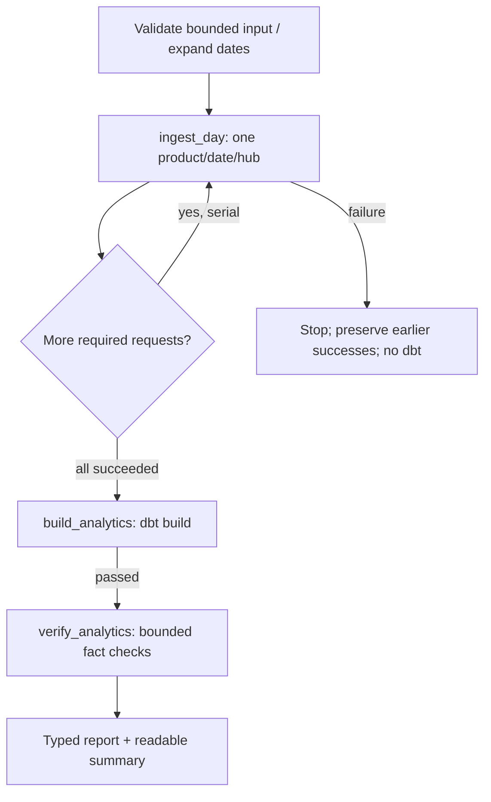

# Orchestration contract

Phase 4 native local and controlled BigQuery/dbt verification passed. The real
two-day backfill and rerun remain incomplete after a daily-quota stop; see the
[verification and exact resume point](../verification/phase4.md).
[ADR 007](../adr/007-local-flyte-orchestration.md) records the decision.
Phase 1 observation identities, Phase 2 persistence and Phase 3 SQL are unchanged.

## Inputs and task graph

`Backfill` is a standard-library dataclass. Required fields are a 32-character
lowercase UUID `backfill_id`, `start_date` and `end_date` in YYYY-MM-DD form.
Dates are **inclusive Pacific market dates**, with one to seven completed days.
Optional fields: `ingest_lmp=true`, `ingest_load=true`,
`locations=["TH_NP15_GEN-APND"]`, `run_dbt=true`, `concurrency=1`.

The whole plan validates before external I/O. It rejects reversed, malformed,
future/incomplete or overlong ranges, no selected products, unknown/duplicate
hubs, empty hubs with LMP, and concurrency other than one. Selecting load on a
Pacific fall-back day remains unsupported under the Phase 1 contract.
All three existing LMP hubs are accepted; no new products are added.

Dates expand ascending; each date expands sorted selected LMP hubs then load.
Each unit is one product, one market date and one hub for LMP. It retains the
existing maximum 300-observation batch and is never a date-range transaction.



`ingest_day` delegates to `ingest()` and `BigQueryWarehouse`; those functions
own source calls, normalization, validation, content deduplication, transitions
and reconciliation. Output is a small `IngestionResult`: unit/run ID, status,
accepted count, new-content/transition counts, and whether an existing success
was reused. It does not return domain records or pandas data.

`build_analytics` runs the adapter cost-cap regression, copies the committed
100 MiB profile to ignored invocation artifacts, and calls the existing dbt
executable. Nonzero exit, missing results or any non-passing result fails the
task. Logs and run_results remain under `artifacts/orchestration/`, with a
separate directory for each dbt invocation. SQL is not duplicated in Python.

`verify_analytics` checks requested dates/hubs in current facts. Relations must
exist, logical keys must be unique, originating runs must be SUCCEEDED and
each requested slice must contain at least the number accepted by ingestion.
A partial source retrieval can leave previously accepted facts in place; this
check is not a source completeness guarantee. The dbt build also runs the
existing full reconciliation and data/unit tests. MW remains MW.

## Run IDs, retry and resume

The run ID is:
`uuid5(UUID(backfill_id), "backfill-unit/v1:" + Request.request_id).hex`.

`Request.request_id` retains the Phase 2 `bounded-request/v1` serialization.
Date/hub input order does not change run IDs. A larger plan using the same
backfill UUID reuses shared units. Never reuse that UUID to mean a new source
retrieval. Save the input UUID along with the explicit plan.

| State / failure | Action |
| --- | --- |
| Before a manifest exists | Same-ID retry is safe for selected transient failures. |
| STARTED | Re-enter Phase 2 using the same ID; reconcile before retrieving again. |
| Uncertain commit submission | Stop; resume the same backfill ID so Phase 2 looks up the original job. |
| COMMITTED, not finalized | Stop automatic retries; explicit same-ID resume reconciles/finalizes. |
| SUCCEEDED | Return original accepted count; skip retrieval and report zero new contents/transitions for this invocation. |
| FAILED | Terminal. A later corrected retrieval uses a new backfill UUID. |
| Schema, validation, unsupported input, auth or quota failure | No automatic retry. |
| dbt data test failure / timeout | No automatic retry; diagnose before rerunning. |

The task allows **one retry** after two seconds for typed transient connection,
timeout or selected 5xx service errors, only when manifest state makes that
safe. Unknown state is not guessed safe. A source network failure already
marked FAILED by `ingest()` is terminal even if its cause was transient.
Existing source-library request behavior remains unchanged.

A retry/resume after uncertain acceptance does not generate another run ID.
Exact repeated retrieval under a *new* backfill UUID creates new manifests but
uses Phase 2 deduplication: unchanged A→A adds neither contents nor transitions.
A→B and B→A continue to be decided by Phase 2, not by Flyte.

Counts in a resumed unresolved run describe the reconciled attempt, not a
measured delta in rows physically written by the resumed process. A reused
SUCCEEDED manifest is explicitly marked and contributes zero new-row counts.

Fail-fast preserves completed independent requests and leaves later requests
unstarted. CLI errors name the failed date/product/hub and run ID; successful
units are printed as they finish. A successful report is printed only after
the requested graph completes. `run_dbt=false` labels dbt and verification
**skipped**, never passed.

## Concurrency, quiescence and timeouts

Concurrency is one because all raw commits share the dataset-wide guard.
The workflow awaits every required ingestion before dbt. This supplies
quiescence within that workflow, not a lock across independent processes.
Run only one cooperating backfill/dbt writer per target and avoid independent
ingestion during dbt reconciliation.

Warehouse request waits retain Phase 2 limits. dbt's subprocess has a
900-second timeout and query jobs retain the profile's 120-second execution
timeout. Flyte's remote scheduling timeouts are not enforced as a hard local
process-kill contract here. Some source-library network calls can outlive a
desired task deadline. Stop the local process if needed, then inspect/resume
the same IDs; a submitted cloud job may continue.

## Reproducible native setup and commands

From the checkout, using the existing Python 3.12 environment:

```powershell
.\.venv\Scripts\python.exe -m venv artifacts/flyte-venv
.\artifacts\flyte-venv\Scripts\python.exe -m pip install -e ".[dev]" -r orchestration/requirements.txt
.\artifacts\flyte-venv\Scripts\python.exe -m pip check
$env:PYTHONUTF8 = "1"
.\artifacts\flyte-venv\Scripts\python.exe -c "import flyte; print(flyte.__version__)"
.\artifacts\flyte-venv\Scripts\flyte.exe run --local --raw-data-path artifacts/flyte/raw orchestration_checks/fixture_workflow.py verify_workflow
```

On Linux, use `bin/python` and `bin/flyte` instead of `Scripts/*.exe`.
The native SDK stores temporary task metadata under its local `/tmp/flyte`
default (a rooted temporary path on Windows); project reports and offloaded
outputs use ignored repository artifacts. No remote Flyte login is needed.

Install dbt separately using `dbt/requirements.txt` as documented in the
[analytics contract](analytics.md). Set the existing nonsecret environment
variables `GCP_PROJECT_ID`, `BQ_RAW_DATASET`, `BQ_ANALYTICS_DATASET`,
`BQ_LOCATION`, and optional `PMD_CODE_REVISION`. Use existing user ADC;
credentials do not belong in the plan, environment file or repository.

After checking quota headroom, this is the small intended live invocation:

```powershell
$backfillId = [guid]::NewGuid().ToString("N")
$spec = @{
  backfill_id = $backfillId
  start_date = "2026-08-02"
  end_date = "2026-08-03"
  ingest_lmp = $true
  ingest_load = $true
  locations = @("TH_NP15_GEN-APND")
  run_dbt = $true
  concurrency = 1
} | ConvertTo-Json -Compress
.\artifacts\flyte-venv\Scripts\flyte.exe run --local --raw-data-path artifacts/flyte/raw orchestration/flyte_pipeline.py backfill --spec $spec
```

Save `$spec` and its UUID. Repeating that command resumes existing attempts.
For a new retrieval/rerun, create a new UUID while retaining the same bounded
dates and products. Do not use a new UUID to bypass an unresolved COMMITTED run.
The existing `power-market-data warehouse inspect/resume --run-id ...`
commands can inspect and reconcile individual attempts.

## Checks and opt-in cloud verification

Ordinary tests require no credentials or network:

```powershell
.\.venv\Scripts\python.exe -m pytest
.\artifacts\flyte-venv\Scripts\python.exe -m mypy orchestration orchestration_checks orchestration_integration_tests
.\artifacts\flyte-venv\Scripts\python.exe -m pytest orchestration_checks
```

The native fixture graph patches external boundaries, executes the real Flyte
tasks and real Phase 2 ingestion/planning functions, and blocks sockets. It
checks both products through CLI/SDK execution: transient retry, fail-fast
interruption, same-ID resume, exact repeats, terminal failure/new-attempt
recovery and equivalence to three separately invoked days. This is **not**
proof of native BigQuery transactions or dbt materialization.

With ADC and sufficient quota, the separate integration command is:

```powershell
.\artifacts\flyte-venv\Scripts\python.exe -m pytest orchestration_integration_tests --run-flyte-bigquery -v
```

It creates four explicitly owned disposable datasets for two scenarios. It
compares six bounded daily ingestions with the actual Flyte graph over the same
three synthetic LMP/load dates, injects acknowledgement loss after acceptance,
resumes, repeats, and runs real dbt builds. Content identities, transition
identities at logical grain, ordinals, and complete fact fields except
attempt-specific IDs/retrieval/knowledge clocks must agree. Commit sequences
also agree for the corresponding original successful requests. Operational
timestamps and run UUIDs are not required to match independent executions.

Cleanup runs in `finally`, checks the ownership label, deletes only allocated
datasets and lists remaining datasets. Analytics test tables expire after a
day; raw test tables do not get a TTL because that contradicts the raw contract.
If the test process is forcibly killed, inspect its exact allocated names and
ownership labels and clean them manually. The test never runs in CI automatically.

## Cost and remaining limits

Keep 100 MiB query caps, the 5 GiB daily custom quota and the $1 monthly budget
alert unchanged. Ordinary CI makes no cloud queries. A budget alert is not a
hard cap or a zero-cost guarantee. Metadata-based preflight does not consume
query bytes; estimate all required builds and raw DML, including BigQuery
minimum billed units, before starting a live run.

The seven-day bound controls scope, not total daily spending. No unrestricted
downloader, scheduler, remote always-on Flyte deployment, distributed workflow
lock, final Data Quality Observatory, as-of consumer analytics or capture-price
analysis is implemented.
